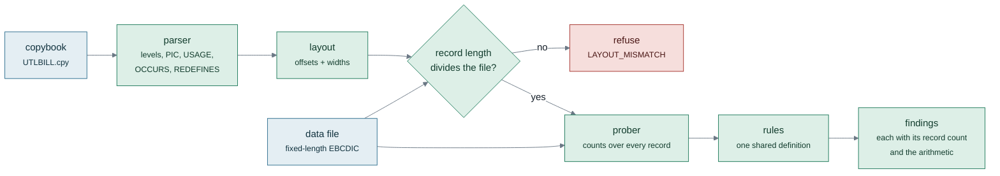
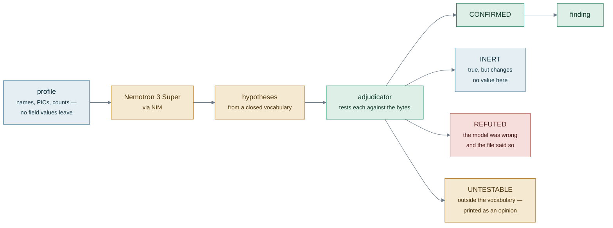
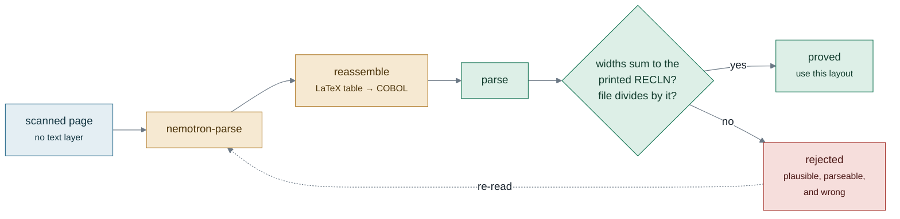
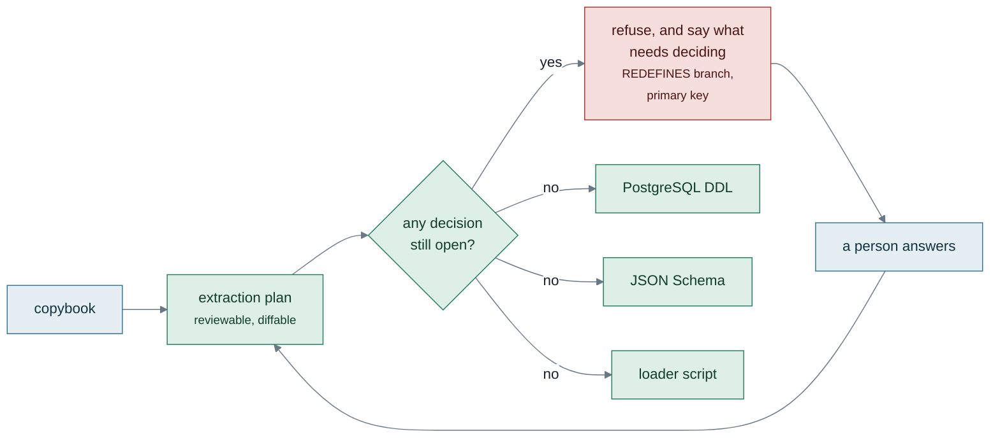
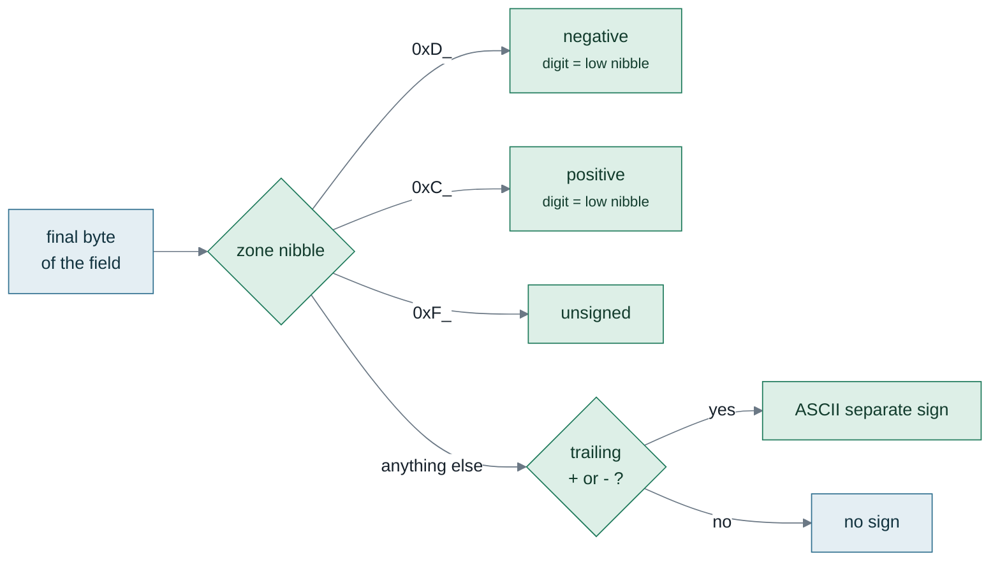
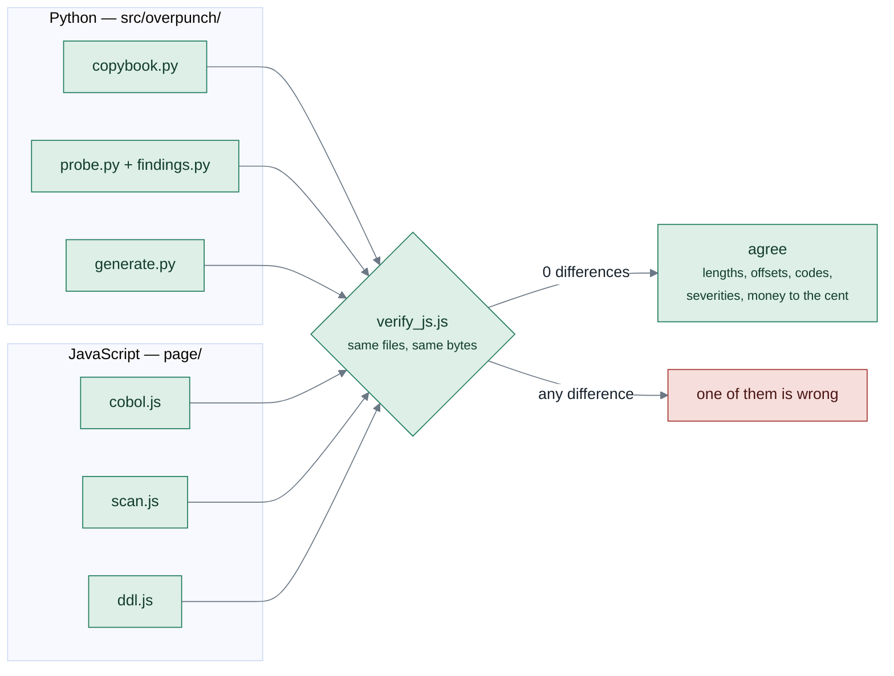
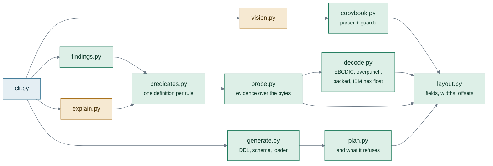

# How overpunch works

Seven diagrams. Each one is here because it carries a claim that is hard to make
in a paragraph — not to decorate the page.

The colour is consistent throughout and means one thing:

- **green** — deterministic, and proved against the bytes
- **amber** — a model, or anything not yet proved
- **red** — refused, rejected, or wrong
- **blue** — data and artefacts

---

## 1. The deterministic core

A copybook describes bytes and nothing enforces that it is telling the truth. So
the first thing that happens is an arithmetic gate: the record length derived
from the field widths must divide the data file exactly. If it does not, this
copybook does not describe this file, and nothing downstream would be
trustworthy — so the scan stops rather than reporting findings about the wrong
bytes.

---

## 2. Nemotron proposes, the bytes dispose

The model is genuinely good at reading forty-year-old English hiding in field
names. It is not good at being believed. So it may only propose from a **closed
vocabulary** of eleven hypothesis kinds the prober knows how to test, and every
proposal is adjudicated against the actual bytes.

The consequence worth stating plainly: **a hallucination cannot become a
finding.** It can only become a refuted hypothesis.

---

## 3. Reading a copybook that is only a photograph

Many copybooks are printouts. `nemotron-parse` reads the page — and gets it
wrong regularly: six reads of one image gave four correct layouts and two wrong
ones, and **both wrong ones parsed as valid COBOL with a plausible field list.**

What makes that survivable is that a copybook makes a falsifiable prediction.
The check is decisive and cheap, so the honest way to use an unreliable reader
is to re-read until a layout is proved.

---

## 4. Nothing is generated from a copybook

A schema needs answers the bytes do not carry: which `REDEFINES` branch is live,
whether a repeating group flattens or normalises, what the key is. So a **plan**
is generated instead, a person edits it, and every target is rendered from the
plan. Generation is blocked while any decision is open.

---

## 5. Where the sign actually lives

The subtlest bug in the project. EBCDIC is a *family* of national code pages, and
`0xD0` is `}` in cp037, `ü` in cp273 and `ğ` in cp1026. Reading the sign from the
decoded **character** works on US data and silently loses German negatives. The
zone nibble of the byte is the layer every page agrees on.

---

## 6. Two implementations, held to the same answers

The page analyses your files **in your browser**, because the data this tool
exists for is exactly the data nobody may upload. That means the parser and the
rules exist twice — and the second one is written separately rather than ported,
so that disagreement is informative.

It has earned its keep three times: the digit-dropping bug in the Python
decoder, the `", "` separators in the DDL header, and the packed values the
browser was validating but never reading.

---

## 7. The modules

`predicates.py` exists because `scan` and `explain` are two callers asking the
same questions of the same measurements, and when each carried its own copy they
drifted.

